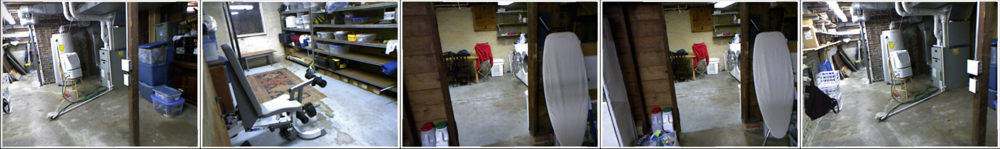
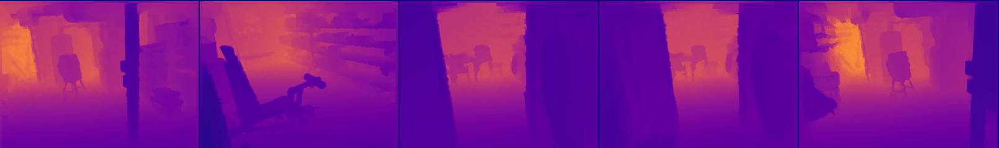
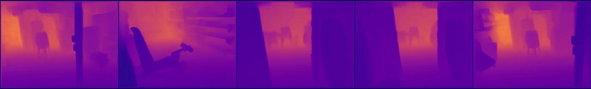
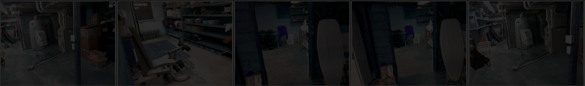
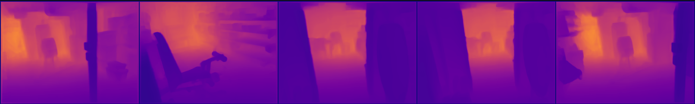
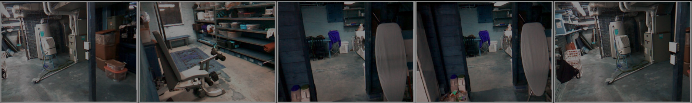
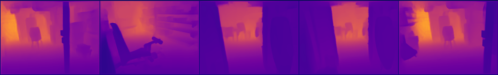

# Low Light Single Image Depth Estimation via Transfer Learning

Depth estimation is a classical problem in computer vision that is essential for many applications including scene understanding, scene reconstruction. Recent developments in convolutional neural networks (CNNs) have helped to gain a leap in the performance; there are still major problems in both quality and the resolution of these estimated depth maps. Incase of low light or monochrome images it gets even harder to estimate depth. We propose to use transfer learning in estimating depth from low light or monochrome grayscale images using a standard encoder-decoder architecture, by leveraging features extracted using high performing pre-trained networks when initializing our encoder. We show how, even for a simple decoder, our method is able to achieve close to state-of-the-art high resolution depth maps on the NYU depth dataset.

## Files
1. [data.py](data.py) - Used to create dataloader from the zip file 
2. [train.py](train.py) - Used to train with dataset, epochs, learning rate, batchsize
3. [model.py](model.py) - Pre-trained model densenet169 as encoder
4. [evaluate.py](evaluate.py) - Evaluation file
5. [bestWeight.pth](https://drive.google.com/file/d/1fLtRqOv9i1paPELqAcBSXhM9KTWkLonp/view?usp=sharing) - Best weight

## Results
#### Example Image

#### Ground Truth Depth Image

#### Estimated Depth Image

#### Sample at 20% Brightness

#### Estimated Depth at 20% Brightness

#### Sample at 60% Brightness

#### Estimated Depth Image

